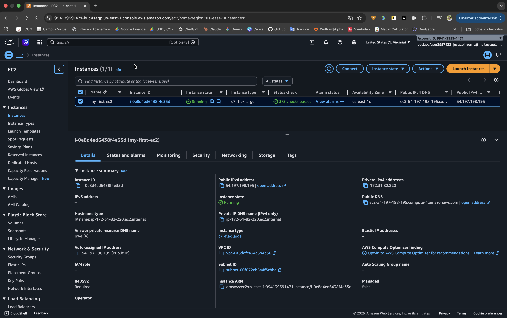
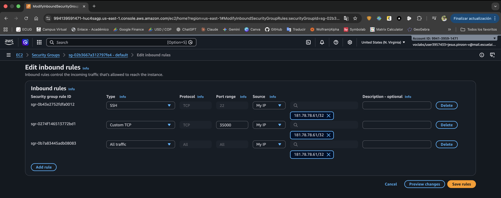
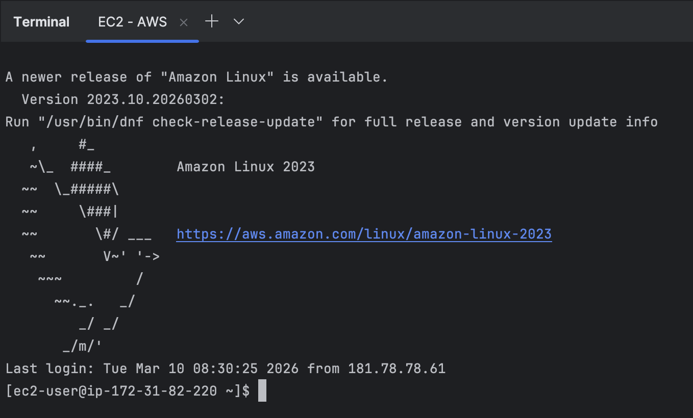
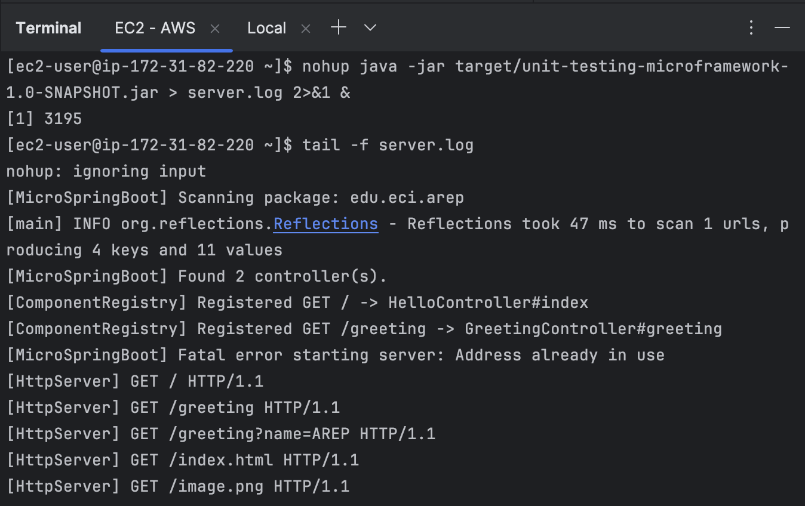
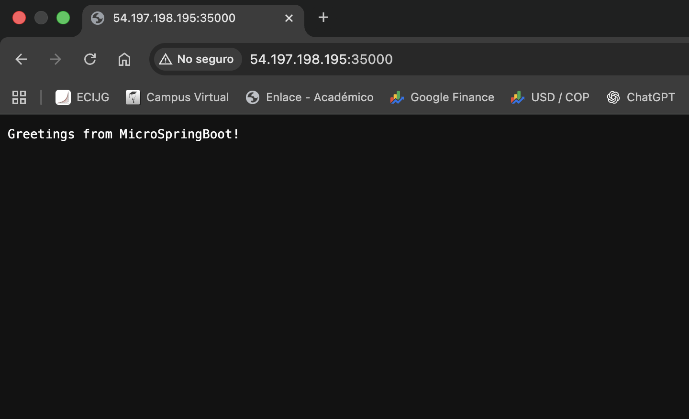
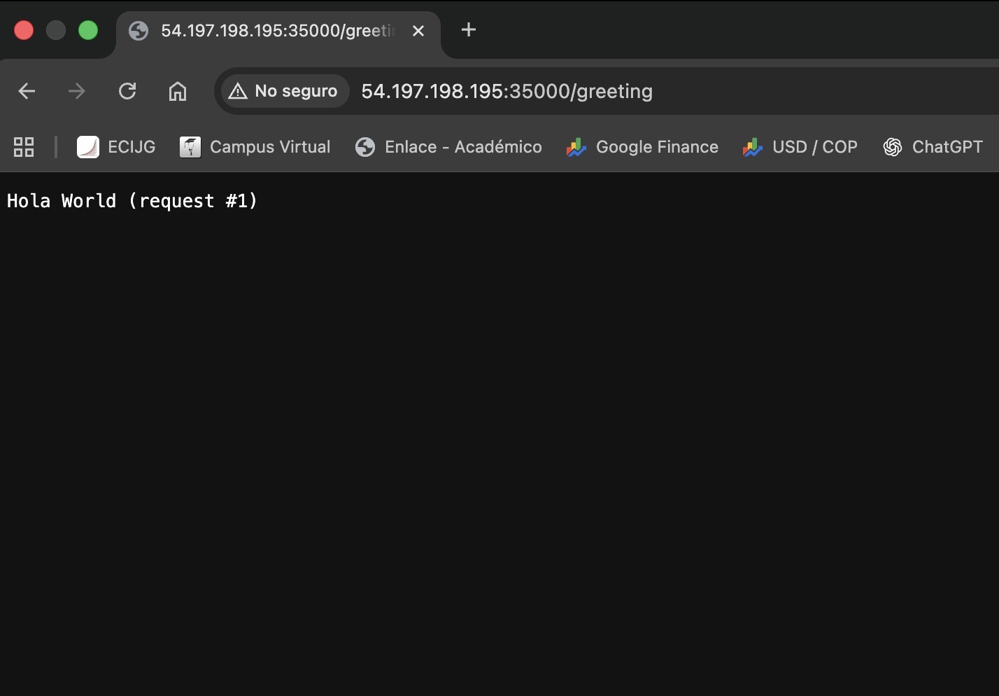
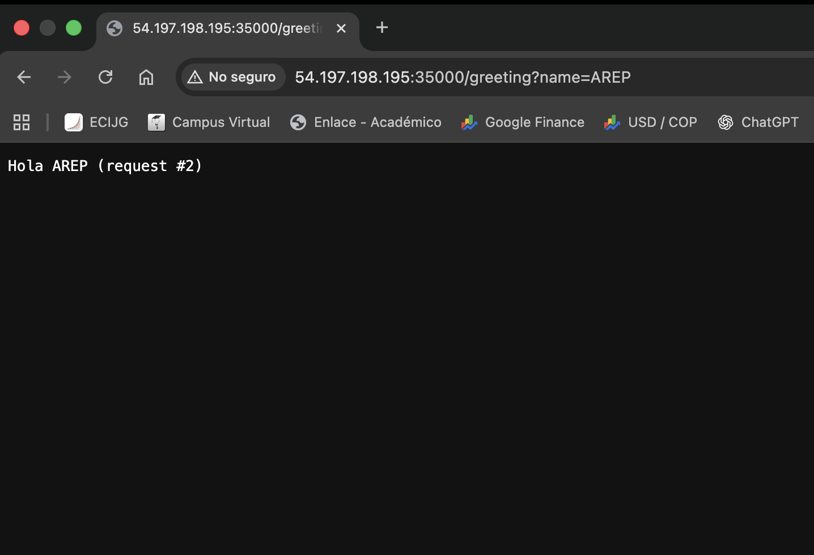
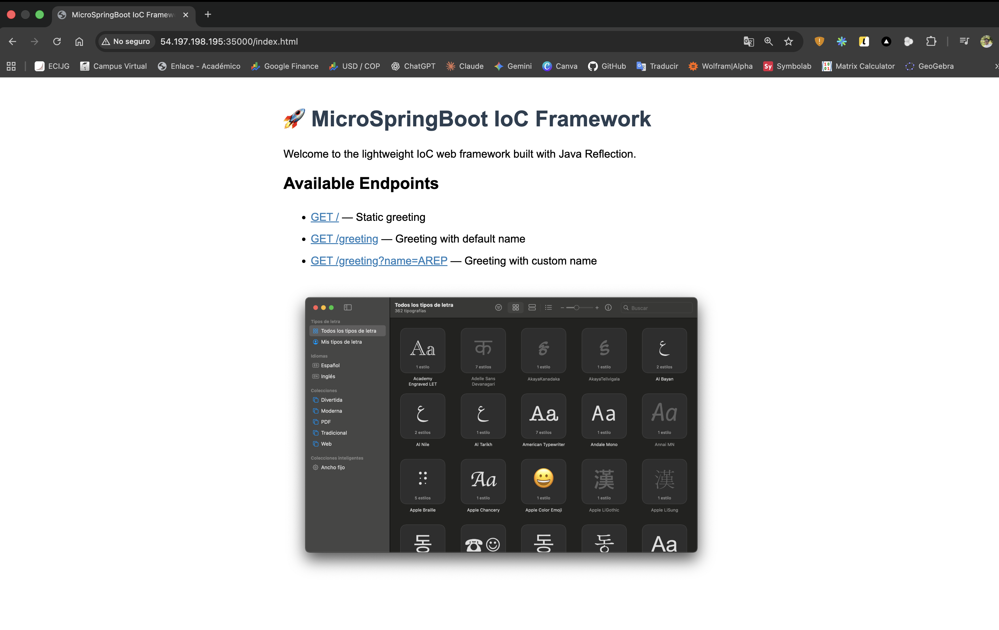
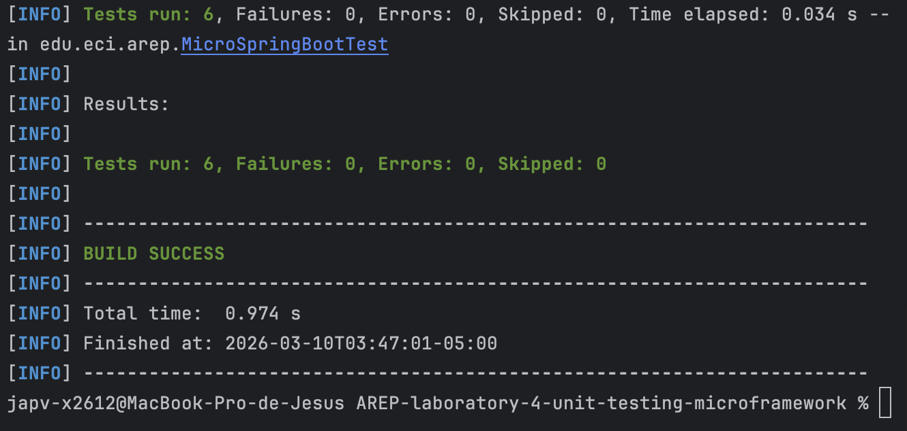

# 🚀 IoC Web Framework with Java Reflection
## Annotation-Driven REST Controller Loading and Classpath Scanning from Scratch

[](https://www.oracle.com/java/)
[](https://maven.apache.org/)
[](https://junit.org/junit5/)
[](https://aws.amazon.com/ec2/)
[](LICENSE)

> **Enterprise Architecture (AREP)** — Laboratory 4  
> Building a lightweight **Inversion of Control (IoC)** web framework in Java using **reflection**, **custom annotations**, and **classpath scanning**, deployed on **AWS EC2**.

---

## 📋 **Table of Contents**

- [Overview](#-overview)
- [Project Structure](#-project-structure)
- [Architecture](#-architecture)
- [Framework Design](#-framework-design)
- [AWS EC2 Deployment](#-aws-ec2-deployment)
- [Acceptance Tests](#-acceptance-tests)
- [Unit Tests](#-unit-tests)
- [Installation and Usage](#-installation-and-usage)
- [Author](#-author)
- [License](#-license)
- [Additional Resources](#-additional-resources)

---

## 🌐 **Overview**

This laboratory implements a **MicroSpringBoot** framework — a minimal but fully functional IoC web server in Java, built entirely from scratch without any external web frameworks. The project demonstrates the **reflective capabilities** of the Java language through:

- ✨ **Custom annotations** (`@RestController`, `@GetMapping`, `@RequestParam`) processed at runtime
- 🔍 **Classpath scanning** to auto-discover and register annotated controller components
- 🌐 **TCP-based HTTP server** serving both static resources and REST endpoints
- ☁️ **Cloud deployment** on an AWS EC2 instance
- 🧪 **Unit testing** of the IoC container without starting an actual server

### Academic Context

This assignment is part of the **Enterprise Architecture (AREP)** course at *Escuela Colombiana de Ingeniería Julio Garavito*, where the **Inversion of Control pattern** and **meta-object protocols** are studied as core architectural capabilities of modern enterprise systems.

---

## 📁 **Project Structure**

```
AREP-laboratory-4-unit-testing-microframework/
├── pom.xml
├── README.md
├── LICENSE
├── assets/
│   └── images/
│       ├── 01-ec2-instance-running.png
│       ├── 02-security-group-inbound-rules.png
│       ├── 03-ssh-connection.png
│       ├── 04-server-startup-log.png
│       ├── 05-browser-root-endpoint.png
│       ├── 06-browser-greeting-default.png
│       ├── 07-browser-greeting-custom-param.png
│       ├── 08-browser-static-html.png
│       └── 09-mvn-test-results.png
└── src/
    ├── main/
    │   ├── java/edu/eci/arep/
    │   │   ├── MicroSpringBoot.java
    │   │   ├── annotations/
    │   │   │   ├── RestController.java
    │   │   │   ├── GetMapping.java
    │   │   │   └── RequestParam.java
    │   │   ├── framework/
    │   │   │   ├── ComponentRegistry.java
    │   │   │   └── RequestRouter.java
    │   │   ├── server/
    │   │   │   ├── HttpServer.java
    │   │   │   └── HttpResponse.java
    │   │   └── controllers/
    │   │       ├── HelloController.java
    │   │       └── GreetingController.java
    │   └── resources/
    │       └── static/
    │           ├── index.html
    │           └── image.png
    └── test/
        └── java/edu/eci/arep/
            └── MicroSpringBootTest.java
```

---

## 🏗️ **Architecture**

The framework follows a layered architecture where each component has a single, well-defined responsibility:

| Layer | Component | Responsibility |
|---|---|---|
| **Entry Point** | `MicroSpringBoot` | Classpath scanning, bean registration, server bootstrap |
| **Annotations** | `@RestController`, `@GetMapping`, `@RequestParam` | Metadata markers processed via reflection at runtime |
| **IoC Container** | `ComponentRegistry` | Stores `URI → Method` and `URI → Instance` mappings |
| **Routing** | `RequestRouter` | Parses HTTP requests, resolves parameters, invokes handlers |
| **Server** | `HttpServer` | TCP accept loop, static file serving, REST delegation |
| **Response** | `HttpResponse` | Builds well-formed HTTP/1.1 response strings |
| **Controllers** | `HelloController`, `GreetingController` | Demo REST components annotated with `@RestController` |

---

## ⚙️ **Framework Design**

### Custom Annotations

The framework defines three runtime-retained annotations that mimic the Spring Boot programming model:

- **`@RestController`** — marks a class as a discoverable IoC component
- **`@GetMapping(value)`** — maps a method to a specific URI path
- **`@RequestParam(value, defaultValue)`** — binds a query string parameter to a method argument

### Classpath Scanning

`MicroSpringBoot` uses the **Reflections** library to scan the `edu.eci.arep` package at startup, collecting all classes annotated with `@RestController`. Each discovered class is instantiated once (singleton), and its `@GetMapping` methods are registered in the `ComponentRegistry`.

The framework also supports **explicit loading** via command-line argument for the minimum viable prototype:

```bash
java -jar target/unit-testing-microframework-1.0-SNAPSHOT.jar edu.eci.arep.controllers.HelloController
```

### Request Routing

When the `HttpServer` receives a request, the `RequestRouter`:

1. Parses the URI path and query string from the raw request line
2. Looks up the handler in `ComponentRegistry`
3. Resolves `@RequestParam` annotations via reflection to build the argument array
4. Invokes the controller method and returns its `String` result

### Static File Serving

Files placed under `src/main/resources/static/` are served directly from the classpath. Supported types include `.html`, `.css`, `.js`, `.png`, and `.jpg`. Requests to `/` are automatically redirected to `/index.html`.

### Invocation Modes

```bash
# Auto-scan mode (discovers all @RestController classes automatically)
java -jar target/unit-testing-microframework-1.0-SNAPSHOT.jar

# Explicit mode (loads a single controller by fully-qualified class name)
java -jar target/unit-testing-microframework-1.0-SNAPSHOT.jar edu.eci.arep.controllers.GreetingController
```

---

## ☁️ **AWS EC2 Deployment**

### Instance Configuration



*AWS EC2 instance `my-first-ec2` running on `us-east-1` with public IPv4 address `54.197.198.195`*

### Security Group — Inbound Rules



*Inbound rules configured with SSH (port `22`) and Custom TCP (port `35000`) open to the developer's IP*

### SSH Connection



*Successful SSH connection to the EC2 instance running Amazon Linux 2023*

Connection command used:

```bash
ssh -i "my-key.pem" ec2-user@54.197.198.195
```

### Server Startup



*Server startup log showing classpath scanning, controller registration, and active request handling on port `35000`*

Deployment command used:

```bash
nohup java -jar target/unit-testing-microframework-1.0-SNAPSHOT.jar > server.log 2>&1 &
tail -f server.log
```

Key startup output:
- `[MicroSpringBoot] Found 2 controller(s).`
- `[ComponentRegistry] Registered GET / -> HelloController#index`
- `[ComponentRegistry] Registered GET /greeting -> GreetingController#greeting`

---

## 🧪 **Acceptance Tests**

### `GET /` — Root Endpoint



*`HelloController#index` responds to `GET /` with a static greeting from the EC2 instance*

### `GET /greeting` — Default Parameter



*`GreetingController#greeting` responds to `GET /greeting` injecting the `@RequestParam` default value `"World"`*

### `GET /greeting?name=AREP` — Custom Parameter



*`@RequestParam` injection working correctly — the query parameter `name=AREP` is resolved via reflection and passed to the controller method*

### `GET /index.html` — Static File Serving



*Static `index.html` served from the classpath under `/static/`, including the embedded navigation links and image*

---

## ✅ **Unit Tests**



*`mvn test` — 6 tests run, 0 failures, 0 errors in `MicroSpringBootTest` — `BUILD SUCCESS` in 0.974 s*

The test suite validates the core IoC container without starting an HTTP server:

| Test | Description | Result |
|---|---|---|
| `testRootEndpointRegistered` | Verifies `GET /` is registered in `ComponentRegistry` | ✅ |
| `testGreetingEndpointRegistered` | Verifies `GET /greeting` is registered | ✅ |
| `testUnknownRouteReturnsNull` | Unregistered routes return `null` from the router | ✅ |
| `testRootRouteResponse` | `HelloController#index` returns a response containing `"Greetings"` | ✅ |
| `testGreetingDefaultParam` | Default `@RequestParam` value `"World"` is injected correctly | ✅ |
| `testGreetingCustomParam` | Custom query parameter `name=AREP` is resolved and injected | ✅ |

Run tests locally with:

```bash
mvn test
```

---

## 🚀 **Installation and Usage**

### Prerequisites

- **Java 17+**
- **Maven 3.9+**
- **AWS EC2** instance (Amazon Linux 2023, `t2.micro` or higher)

### Local Execution

```bash
# Clone the repository
git clone https://github.com/JAPV-X2612/AREP-laboratory-4-unit-testing-microframework.git
cd AREP-laboratory-4-unit-testing-microframework

# Build the fat JAR
mvn clean package

# Run the server (auto-scan mode)
java -jar target/unit-testing-microframework-1.0-SNAPSHOT.jar
```

Then open your browser at:

```
http://localhost:35000/
http://localhost:35000/greeting
http://localhost:35000/greeting?name=AREP
http://localhost:35000/index.html
```

### AWS EC2 Deployment

```bash
# Upload JAR to EC2
scp -i "my-key.pem" target/unit-testing-microframework-1.0-SNAPSHOT.jar \
    ec2-user@<PUBLIC_IP>:/home/ec2-user/target/

# Connect via SSH
ssh -i "my-key.pem" ec2-user@<PUBLIC_IP>

# Run in background
nohup java -jar target/unit-testing-microframework-1.0-SNAPSHOT.jar > server.log 2>&1 &
tail -f server.log
```

Open port `35000` in the EC2 Security Group inbound rules, then access:

```
http://<PUBLIC_IP>:35000/
```

### Key Maven Commands

```bash
mvn clean package    # Compile and build fat JAR
mvn test             # Run unit tests
mvn clean            # Clean build artifacts
```

---

## 👥 **Author**

<table>
  <tr>
    <td align="center">
      <a href="https://github.com/JAPV-X2612">
        
        <br />
        <sub><b>Jesús Alfonso Pinzón Vega</b></sub>
      </a>
      <br />
      <sub>Full Stack Developer</sub>
    </td>
  </tr>
</table>

---

## 📄 **License**

This project is licensed under the **Apache License, Version 2.0** — see the [LICENSE](LICENSE) file for details.

---

## 🔗 **Additional Resources**

### Java Reflection and Annotations
- [Java Reflection API — Official Documentation](https://docs.oracle.com/en/java/docs/books/tutorial/reflect/index.html)
- [Java Annotations — Oracle Tutorial](https://docs.oracle.com/javase/tutorial/java/annotations/)
- [Reflections Library — GitHub](https://github.com/ronmamo/reflections)

### IoC and Design Patterns
- [Inversion of Control Containers and the Dependency Injection Pattern — Martin Fowler](https://martinfowler.com/articles/injection.html)
- [IoC Pattern — Refactoring Guru](https://refactoring.guru/design-patterns)

### HTTP and Networking
- [HTTP/1.1 Specification — RFC 7230](https://datatracker.ietf.org/doc/html/rfc7230)
- [Java ServerSocket — Official Documentation](https://docs.oracle.com/en/java/se/17/docs/api/java.base/java/net/ServerSocket.html)

### AWS EC2
- [AWS EC2 Documentation](https://docs.aws.amazon.com/ec2/)
- [AWS Security Groups — User Guide](https://docs.aws.amazon.com/vpc/latest/userguide/vpc-security-groups.html)

### Testing
- [JUnit 5 User Guide](https://junit.org/junit5/docs/current/user-guide/)
- [Maven Surefire Plugin](https://maven.apache.org/surefire/maven-surefire-plugin/)

---

⭐ *If you found this project helpful, please consider giving it a star!* ⭐